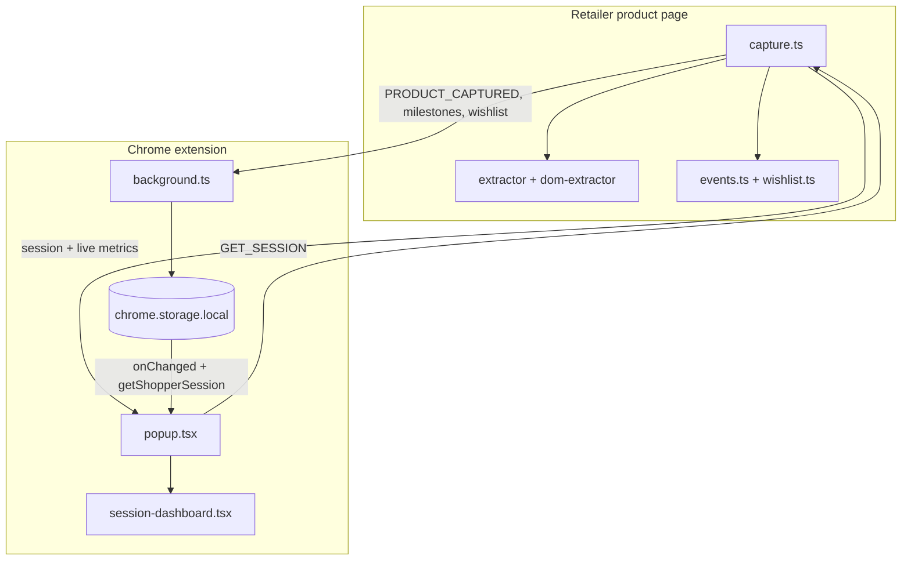

# How everything connects

This page walks through **one complete scenario**: you open a product on ASOS, scroll, wait, save to wishlist, then open the Fohlioo popup.

## Step-by-step story

### 1. You land on a product page

Chrome loads the page. Because the URL matches `config.matches` in `contents/capture.ts`, our **content script** runs automatically.

At the bottom of `capture.ts`, `startCaptureWithRetry()` runs immediately — and again after SPA navigation (Zara/ASOS change URL without full reload). React PDPs may need several retries before `captureProduct()` succeeds.

### 2. Product extraction

`captureProduct()` runs three extractors and merges them:

```
JSON-LD  →  Open Graph  →  DOM fallback
   (best)      (backup)       (fills gaps, especially sizes)
```

Result: a `ProductData` object (see `interface.ts`).

If there's no name **and** no brand, we assume it's not a product page and stop.

### 3. First message to background

`publishCapture()` sends:

```text
{ type: 'PRODUCT_CAPTURED', data: productData }
```

**Background** (`background.ts`) receives this and calls `buildInitialSession(product)` → saves to `chrome.storage.local` under key `shopperSession`.

The session starts with:
- The product
- Dwell 0, scroll 0
- Wishlist “unknown”
- One event: “Product page opened”

### 4. Behaviour tracking starts

Still in the content script, on the same page view:

| Tracker | File | What it does |
|---------|------|--------------|
| Engagement | `lib/sites/*/engagement.ts` | Section clicks → `SECTION_ENGAGEMENT` |
| Dwell | `lib/events.ts` → `startDwellTracking` | Counts visible time; fires at 15s–180s |
| Scroll | `lib/events.ts` → `startScrollTracking` | Tracks max scroll %; fires at 25%–90% |
| Wishlist | `lib/events.ts` → `startWishlistTracking` | Save/heart via `lib/wishlist.ts` + site modules |

Each milestone sends a message (`DWELL_MILESTONE`, `SCROLL_MILESTONE`, `WISHLIST_*`, `SECTION_ENGAGEMENT`) to **background**.

Background calls `applySessionUpdate()` which:
- Appends to `recentEvents` (max 10)
- Updates `dwellMs`, `scrollDepthPct`, or `wishlistStatus`
- Writes back to storage

### 5. Live numbers while you're still on the page

Dwell and scroll also update **in-memory counters** in the content script (`getLiveMetrics()`). These can be **ahead** of stored milestones (e.g. you've been on page 22s but only the 15s milestone was saved).

When the popup asks for session data, we merge stored + live so the UI feels realtime.

### 6. You click the Fohlioo icon (popup opens)

`popup.tsx` mounts and:

1. Calls `fetchShopperSession()` (`lib/popup-product.ts`)
2. That messages the **active tab’s content script**: `GET_SESSION`
3. Content script re-captures product (fresh data), merges stored session + `getLiveMetrics()`, responds
4. Popup renders `SessionDashboard` with that session
5. Every **2 seconds** it polls again; also listens to `chrome.storage.onChanged` for instant updates when background writes

### 7. You navigate to another product (SPA)

`capture.ts` watches `location.href` via `MutationObserver`. On change, after 800ms, `startCaptureWithRetry()` runs — `ProductPageController.stop()` then `start()` for fresh product and trackers.

---

## Diagram



## Why three layers?

| Layer | Why it exists |
|-------|----------------|
| Content script | Only code that can see the retailer’s DOM and user scroll/clicks |
| Background | Central place to update storage; survives popup closing |
| Popup | Sandboxed React UI; asks active tab for freshest live metrics |

## Common confusion cleared up

**“Where is the product stored?”**  
In `chrome.storage.local` as part of `shopperSession`, and duplicated as `latestProduct` for quick access.

**“Why message background if popup could read storage only?”**  
Live dwell/scroll lives in the content script until milestones fire. Popup needs `GET_SESSION` to merge live + stored.

**“Why 800ms delay on SPA navigation?”**  
Sites like ASOS render product HTML after the URL changes. Capturing too early gives empty sizes or wrong product.

**“What if background is reloading?”**  
`.catch(() => {})` on sendMessage — extension dev reload breaks the connection briefly; user sees “Context invalidated” until page refresh.
